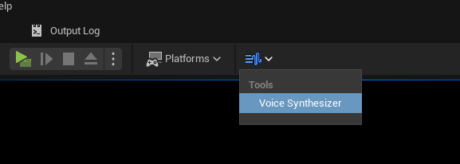
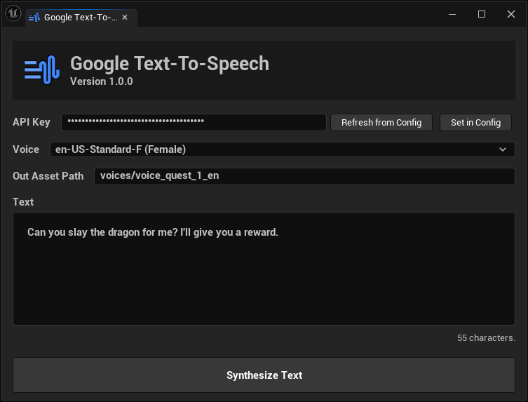

# Editor Tools

Starts by opening the voice synthesizer.

1. If you didn't set your API key yet, enter the API key in the `API Key` field.
2. Select the voice for your language.
3. Enter the text you want to synthesize.
4. Add a valid path to where the asset should be created.
5. Click on `Synthesize Text`.

