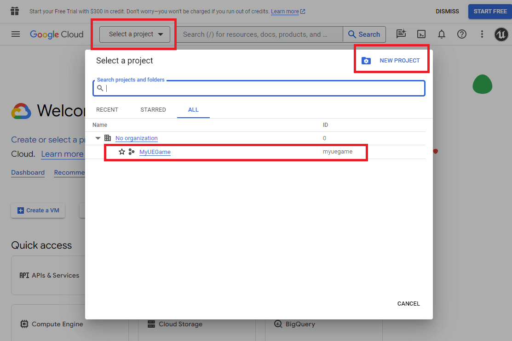
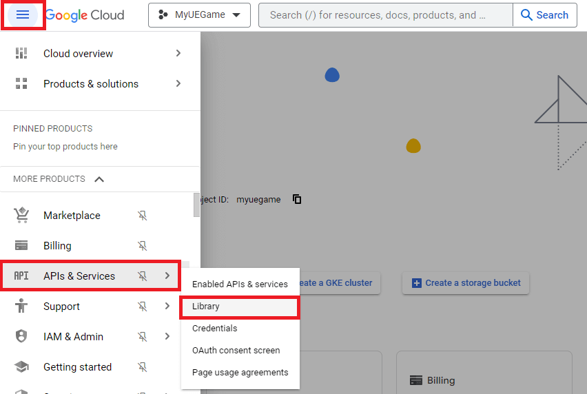
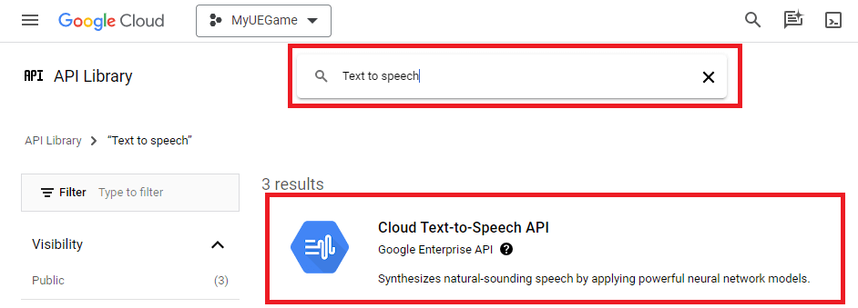
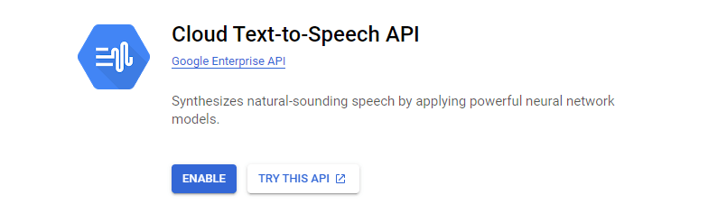
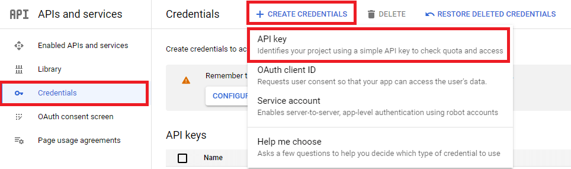
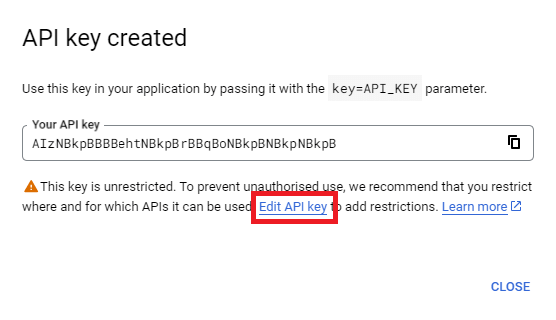
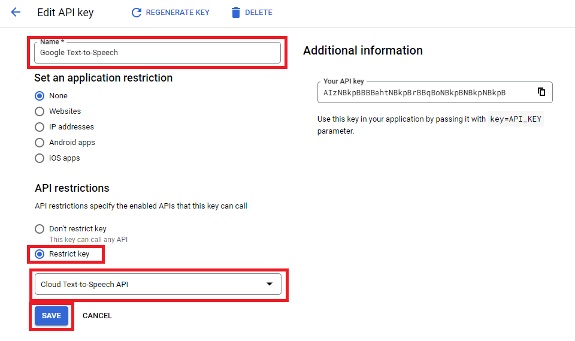
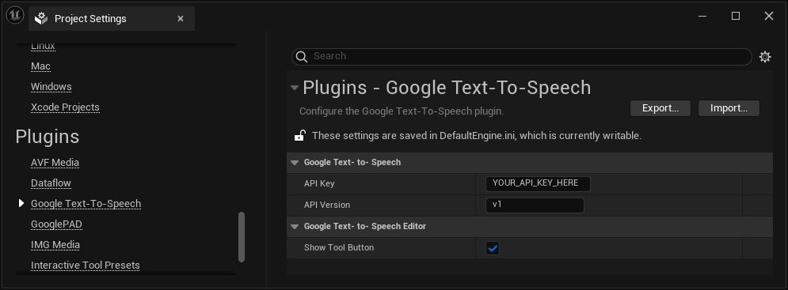

# Setup The Plugin

This section covers how to setup the plugin. It assumes you already have a standard Google Account.

## **1.** Enable the Google Text-To-Speech API.

1. If you don't have a *Google Cloud Platform* account, sign up [here](https://cloud.google.com/free).
2. Go to the [Google Cloud Console](https://console.cloud.google.com/) and create a new project, or select an existing one.

<div class="centered">



</div>

3. Open the `API & Services` library.

<div class="centered">



</div>

4. Search for `Text to speech` and select `Cloud Text-to-Speech API`.

<div class="centered">


</div>

5. Click on `Enable` to enable the Google Text-to-Speech API for the project.

<div class="centered">


</div>

> You need to enable billing for the account.

## **2.** Get an API Key
1. Go to the [Google Cloud API Credentials page](https://console.cloud.google.com/apis/credentials) and click on `Create Credentials` > `API key`.


<div class="centered">


</div>

2. Once the API key is created, copy the key and click on `Edit API key`.

<div class="centered">


</div>

3. Enter a unique name for your API key.
4. Select `Restrict Key`. In the combo box, select `Cloud Text-to-Speech API`.
6. Click `Save`.

<div class="centered">


</div>

## **3.** Use the API Key

The last step is to use the API key to allow the plugin to synthesize text.

There are three ways to setup the API key.

### **3.1.** Use an Environment Variable

The plugin automatically checks for an environment variable named `UE_GTTS_APIKEY`. If it is set, its value will be used.

!> Using this method will only work on devices where the variable is set. If you package the game and run it on another device, it won't be able to read the API key.

### **3.2.** Use the Plugin's Configuration

Open the project's settings, and paste your API key under API Key.

<div class="centered">


</div>

!> Doing that will package the API key in a config file. Make sure you correctly restricted its use.

### **3.3.** Set the API Key Programmatically

You can set the API key by calling the `SetAPIKey` function:

<div class="code-switcher show-cpp-false"><div class="switcher">
<span class="sw-bp" onclick="switchBp()">Blueprints</span><span class="sw-cpp" onclick="switchCpp()">C++</span></div>
<div class="cpp">

```cpp
// Header for the function.
#include "GoogleTTS/GoogleTTS.h"

// In some function called at the beginning of your app.
GoogleTTS::SetAPIKey(TEXT("YOUR_API_KEY"));
```

</div>
<div class="bp">
<div class="bpcode">
<textarea readonly>
Begin Object Class=/Script/BlueprintGraph.K2Node_Event Name="K2Node_Event_3" ExportPath="/Script/BlueprintGraph.K2Node_Event'/Game/DemoActor.DemoActor:EventGraph.K2Node_Event_3'"
   EventReference=(MemberParent="/Script/CoreUObject.Class'/Script/Engine.Actor'",MemberName="ReceiveBeginPlay")
   bOverrideFunction=True
   NodePosX=-2512
   NodePosY=-2531
   NodeGuid=19E7426B43B43126C54BD995A99C3E86
   CustomProperties Pin (PinId=C8D34DA747DAAD2DA7245DAAD0FD0E25,PinName="OutputDelegate",Direction="EGPD_Output",PinType.PinCategory="delegate",PinType.PinSubCategory="",PinType.PinSubCategoryObject=None,PinType.PinSubCategoryMemberReference=(MemberParent="/Script/CoreUObject.Class'/Script/Engine.Actor'",MemberName="ReceiveBeginPlay"),PinType.PinValueType=(),PinType.ContainerType=None,PinType.bIsReference=False,PinType.bIsConst=False,PinType.bIsWeakPointer=False,PinType.bIsUObjectWrapper=False,PinType.bSerializeAsSinglePrecisionFloat=False,PersistentGuid=00000000000000000000000000000000,bHidden=False,bNotConnectable=False,bDefaultValueIsReadOnly=False,bDefaultValueIsIgnored=False,bAdvancedView=False,bOrphanedPin=False,)
   CustomProperties Pin (PinId=4450491842A1DBE7D5B448AC823354F1,PinName="then",Direction="EGPD_Output",PinType.PinCategory="exec",PinType.PinSubCategory="",PinType.PinSubCategoryObject=None,PinType.PinSubCategoryMemberReference=(),PinType.PinValueType=(),PinType.ContainerType=None,PinType.bIsReference=False,PinType.bIsConst=False,PinType.bIsWeakPointer=False,PinType.bIsUObjectWrapper=False,PinType.bSerializeAsSinglePrecisionFloat=False,LinkedTo=(K2Node_CallFunction_10 BACBE32241C4963151B9A1A7750D3974,),PersistentGuid=00000000000000000000000000000000,bHidden=False,bNotConnectable=False,bDefaultValueIsReadOnly=False,bDefaultValueIsIgnored=False,bAdvancedView=False,bOrphanedPin=False,)
End Object
Begin Object Class=/Script/BlueprintGraph.K2Node_CallFunction Name="K2Node_CallFunction_10" ExportPath="/Script/BlueprintGraph.K2Node_CallFunction'/Game/DemoActor.DemoActor:EventGraph.K2Node_CallFunction_10'"
   FunctionReference=(MemberParent="/Script/CoreUObject.Class'/Script/GoogleTTS.GoogleTTSBlueprintLibrary'",MemberName="SetAPIKey")
   NodePosX=-2272
   NodePosY=-2528
   NodeGuid=8FA5A51246362AD1C01CAD8D0D4E2C6D
   CustomProperties Pin (PinId=BACBE32241C4963151B9A1A7750D3974,PinName="execute",PinToolTip="\nExec",PinType.PinCategory="exec",PinType.PinSubCategory="",PinType.PinSubCategoryObject=None,PinType.PinSubCategoryMemberReference=(),PinType.PinValueType=(),PinType.ContainerType=None,PinType.bIsReference=False,PinType.bIsConst=False,PinType.bIsWeakPointer=False,PinType.bIsUObjectWrapper=False,PinType.bSerializeAsSinglePrecisionFloat=False,LinkedTo=(K2Node_Event_3 4450491842A1DBE7D5B448AC823354F1,),PersistentGuid=00000000000000000000000000000000,bHidden=False,bNotConnectable=False,bDefaultValueIsReadOnly=False,bDefaultValueIsIgnored=False,bAdvancedView=False,bOrphanedPin=False,)
   CustomProperties Pin (PinId=5864FB19472818FFBA12B3A01490BFC7,PinName="then",PinToolTip="\nExec",Direction="EGPD_Output",PinType.PinCategory="exec",PinType.PinSubCategory="",PinType.PinSubCategoryObject=None,PinType.PinSubCategoryMemberReference=(),PinType.PinValueType=(),PinType.ContainerType=None,PinType.bIsReference=False,PinType.bIsConst=False,PinType.bIsWeakPointer=False,PinType.bIsUObjectWrapper=False,PinType.bSerializeAsSinglePrecisionFloat=False,PersistentGuid=00000000000000000000000000000000,bHidden=False,bNotConnectable=False,bDefaultValueIsReadOnly=False,bDefaultValueIsIgnored=False,bAdvancedView=False,bOrphanedPin=False,)
   CustomProperties Pin (PinId=A1AF3A684DF67FAD236B1E904EA3CD55,PinName="self",PinFriendlyName=NSLOCTEXT("K2Node", "Target", "Target"),PinToolTip="Target\nGoogle TTSBlueprint Library Object Reference",PinType.PinCategory="object",PinType.PinSubCategory="",PinType.PinSubCategoryObject="/Script/CoreUObject.Class'/Script/GoogleTTS.GoogleTTSBlueprintLibrary'",PinType.PinSubCategoryMemberReference=(),PinType.PinValueType=(),PinType.ContainerType=None,PinType.bIsReference=False,PinType.bIsConst=False,PinType.bIsWeakPointer=False,PinType.bIsUObjectWrapper=False,PinType.bSerializeAsSinglePrecisionFloat=False,DefaultObject="/Script/GoogleTTS.Default__GoogleTTSBlueprintLibrary",PersistentGuid=00000000000000000000000000000000,bHidden=True,bNotConnectable=False,bDefaultValueIsReadOnly=False,bDefaultValueIsIgnored=False,bAdvancedView=False,bOrphanedPin=False,)
   CustomProperties Pin (PinId=33E4FC954A54A3B3A515D28842742EB3,PinName="APIKey",PinToolTip="APIKey\nString",PinType.PinCategory="string",PinType.PinSubCategory="",PinType.PinSubCategoryObject=None,PinType.PinSubCategoryMemberReference=(),PinType.PinValueType=(),PinType.ContainerType=None,PinType.bIsReference=False,PinType.bIsConst=False,PinType.bIsWeakPointer=False,PinType.bIsUObjectWrapper=False,PinType.bSerializeAsSinglePrecisionFloat=False,DefaultValue="YOUR_API_KEY",PersistentGuid=00000000000000000000000000000000,bHidden=False,bNotConnectable=False,bDefaultValueIsReadOnly=False,bDefaultValueIsIgnored=False,bAdvancedView=False,bOrphanedPin=False,)
End Object
</textarea>

<button onclick="copyBlueprintCode(this)">Copy Code</button>
</div>
</div>
</div>

!> Doing that will package the API key. Make sure you correctly restricted its use.


## **4.** (Optional) Setup Plugin for C++ Use
An additional setup must be done to use the plugin from C++. You can skip this step if you don't intend to use the plugin using C++.

### **4.1.** Add the `GoogleTTS` Module
Open the `<ModuleName>.Build.cs` file and add the following line in the constructor:

```cs
PrivateDependencyModuleNames.Add("GoogleTTS");
```

> You need to regenerate project files for the includes to work.

### **4.2.** Include the Files

At the top of the file where you want to use the API, add the following line:

```cpp
#include "GoogleTTS/GoogleTTS.h"
```


<script>
setTimeout(() => {
	bShowCPP = !JSON.parse(getCookie('bShowCPP'));
	switchCode();
}, 0);
</script>

